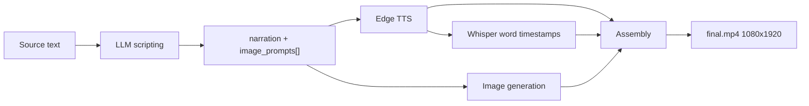

# Faceless

Turns a block of text into a narrated, subtitled **1080×1920 vertical video**.

You paste a story or script. An LLM splits it into narration and visual prompts, Edge TTS voices the narration, Whisper produces word-level timestamps, an image model generates one still per scene, and MoviePy stitches it all into an MP4 with animated word-highlight captions.

Runs entirely on your machine, or leans on APIs — your choice, per stage.

---

## What it does

- **LLM scripting** — Ollama (local, free), DeepSeek, or OpenRouter
- **Text-to-speech** — Edge TTS, free, no key, every English voice it exposes
- **Transcription** — faster-whisper with word timestamps, CPU, int8
- **Images** — OpenRouter (Gemini 3.x, Grok Imagine) or local SDXL / SDXL Turbo
- **Assembly** — MoviePy + FFmpeg, 1080×1920 @ 24 fps, H.264/AAC
- **Captions** — word-by-word highlighting with a pop-scale animation
- **Cost estimate** before you spend anything, and actual cost tracking after
- **Resume** — every run checkpoints to disk; failed runs restart from the last good stage

---

## Requirements

| | |
|---|---|
| **Python** | 3.13 |
| **OS** | Windows (see [Platform notes](#platform-notes)) |
| **Disk** | ~1.3 GB for dependencies; ~7 GB more per local SDXL model, ~150 MB for Whisper |
| **GPU** | Optional. CPU works, slowly. |

FFmpeg is **not** required on your PATH — MoviePy resolves a bundled binary automatically.

---

## Install

```bash
git clone https://github.com/rlatksk/faceless.git
cd faceless

py -3.13 -m venv .venv
.venv\Scripts\activate
pip install -r requirements.txt
```

Copy the example env file and fill in the keys you need:

```bash
copy .env.example .env
```

```ini
OPENROUTER_API_KEY=sk-or-v1-...
DEEPSEEK_API_KEY=...
HF_HOME=E:\Projects\huggingface_cache
```

| Variable | Needed for | Required? |
|---|---|---|
| `OPENROUTER_API_KEY` | OpenRouter LLM + all OpenRouter image models | Only if you use OpenRouter |
| `DEEPSEEK_API_KEY` | DeepSeek LLM | Only if you pick DeepSeek |
| `HF_HOME` | Where Whisper and SDXL weights are cached | Optional but recommended |

The cheapest path needs **no keys at all**: Ollama for scripting, local SDXL Turbo for images, Edge TTS for audio.

Run it:

```bash
streamlit run app.py
```

Opens at `http://localhost:8501`. Launch from the repo root — `.env` and the `output/` directory are both resolved relative to the working directory.

---

## Usage

### 1. Paste your source text

Anything with a narrative: a true-crime story, a Reddit post, a script you wrote. The LLM decides how to split it into scenes.

### 2. Pick a voice and an image model

Voices are pulled live from Edge TTS, filtered to English locales, sorted by name.

| Image model | Provider | Cost |
|---|---|---|
| Gemini 3.1 Flash Lite | OpenRouter | ~$0.035/img |
| Grok Imagine 1K | OpenRouter | ~$0.05/img |
| Gemini 3.1 Flash | OpenRouter | ~$0.07/img |
| Gemini 3 Pro | OpenRouter | ~$0.14/img |
| Local SDXL (10 steps) | Local | Free |
| Local SDXL Turbo | Local | Free |

Add any other OpenRouter model ID under **⚙ Settings → Image Models** (one per line) and it appears in the dropdown.

### 3. Choose a style

**Indie Dark Comic** is the built-in preset — a graphic-novel look with heavy ink outlines, cel shading, and high-contrast lighting. Its template contains a `[INSERT YOUR SCENE / CHARACTER HERE]` placeholder, so each scene prompt gets substituted into it.

Pick **Custom** to supply your own style tag. It is appended to each prompt as `, {your style} style`.

### 4. Estimate, then generate

**Estimate Cost** runs the LLM first (free on Ollama, fractions of a cent on the API providers) to learn how many images will be needed, then shows a cost breakdown. Nothing is charged beyond the LLM call until you press **Generate Video**.

Generation writes everything to `output/<timestamp>/`:

```
output/2026-09-19_143022/
├── project.json       # run state, prompts, steps, cost
├── script.txt         # narration + numbered prompts
├── audio.mp3          # Edge TTS output
├── transcript.json    # [{word, start, end}, ...]
├── img_000.png        # one per scene
├── img_001.png
└── final.mp4          # the deliverable
```

### 5. Resume if it fails

The **Projects** tab lists every run with its progress and cost. Anything `failed` or `in_progress` gets a **Resume** button that restarts from the last incomplete stage — generated images are reused, not regenerated.

---

## How it works



Five stages, always in this order, each one a plain function call in `app.py`:

| Stage | Module | Input | Output |
|---|---|---|---|
| Scripting | `pipeline/script.py` | source text | `{narration, image_prompts[]}` |
| Audio | `pipeline/audio.py` | narration, voice | `audio.mp3` |
| Transcription | `pipeline/transcribe.py` | `audio.mp3` | `[{word, start, end}]` |
| Images | `pipeline/images.py` | prompts, model | `img_NNN.png` + cost |
| Assembly | `pipeline/assemble.py` | images, audio, timestamps | `final.mp4` |

**State lives on the filesystem.** There is no database and no in-memory run state — `project.json` plus the artifacts beside it *are* the run. That is what makes resume work: the app infers which stages completed by checking which files exist.

**Assembly details.** Scene boundaries are placed by dividing total audio duration across the images, then snapping each boundary to the nearest sentence-ending word so cuts land on natural pauses. Captions are grouped into chunks of up to 5 words or 2 seconds, whichever comes first, and rendered word-by-word: a yellow highlight with a pop-scale animation, followed by the same word in white for the remainder of its duration. Font size shrinks automatically if a line would overflow the frame width.

---

## Configuration

`.streamlit/config.toml` sets the dark theme and disables Streamlit telemetry. Most visual styling lives in the `_CSS` block in `app.py` — a Google Fonts import (Teko + Inter), a film-grain overlay, and crimson accents.

Model defaults are editable at runtime under **⚙ Settings**:

- Ollama — `llama3`
- DeepSeek — `deepseek-v4-flash`
- OpenRouter — `openai/gpt-4o-mini`

Local model IDs encode inference steps with a `__N` suffix. `stabilityai/stable-diffusion-xl-base-1.0__10` means SDXL base at 10 steps. Without a suffix, SDXL base runs 30 steps and SDXL Turbo runs 4 at guidance 0.

---

## Project structure

```
faceless/
├── app.py                  # Streamlit UI + pipeline orchestration
├── pipeline/
│   ├── script.py           # Ollama / DeepSeek / OpenRouter
│   ├── audio.py            # Edge TTS
│   ├── transcribe.py       # faster-whisper
│   ├── images.py           # OpenRouter / local diffusers
│   ├── assemble.py         # MoviePy composite + captions
│   └── cost.py             # pricing constants
├── .streamlit/config.toml  # theme + telemetry
├── output/                 # run artifacts (gitignored)
├── requirements.txt
├── AGENTS.md               # notes for AI coding assistants
├── CONTRIBUTING.md
└── .env.example
```

---

## Platform notes

**Windows-first.** The subtitle renderer uses `C:/Windows/Fonts/Arial.ttf` directly. On macOS or Linux that path will not resolve — change `_FONT` in `pipeline/assemble.py` to a font that exists on your system.

**CPU-only by default.** The pinned PyTorch build is CPU-only, so `torch.cuda.is_available()` is always false. Local SDXL is therefore slow — expect minutes per image. SDXL Turbo (4 steps) is dramatically faster and is the recommended free option. CUDA on AMD GPUs is not available.

**First local run downloads weights.** Several GB for SDXL. Set `HF_HOME` to keep them off your system drive. Whisper's `base` model (~150 MB) downloads on first import.

**Streamlit reload behavior.** `app.py` hot-reloads on save. Modules under `pipeline/` do **not** — restart the server after editing them.

---

## Troubleshooting

| Symptom | Cause / fix |
|---|---|
| `Cannot reach Ollama at http://localhost:11434` | Ollama isn't running, or you picked the Ollama provider without starting it. Run `ollama serve`. |
| `OPENROUTER_API_KEY not set in .env` | Key missing or `.env` isn't in the working directory. Launch from the repo root. |
| `Could not load voices` | Edge TTS needs outbound HTTPS. Check connectivity or a proxy. |
| `Only N/M images generated` | One or more image requests failed. Resume — successful images are reused. |
| Projects tab crashes on load | `output/` doesn't exist yet. Run one generation, or create the folder. |
| Resume fails on a local-model project | Known limitation — resume currently forces the OpenRouter provider. See below. |
| Video has no captions | Whisper returned no word timestamps, usually on very short or silent audio. |

---

## Known limitations

- Resume hardcodes the OpenRouter image provider, so a project created with a local model cannot be resumed locally.
- Resuming a project whose `transcript.json` is missing can fail; the backfill logic infers transcription completed from the presence of `final.mp4`.
- A project's `failed` status is recalculated on every render, so the failure indicator is often transient.
- Local SDXL base is quoted at $0.07/img in the estimate despite running locally for free.
- `script.txt` is written in the system codepage on Windows, so non-ASCII characters may render incorrectly.
- Switching between local image models within one session reuses the first loaded pipeline.

See `AGENTS.md` for a fuller list with file and line references.

---

## License

No license has been declared for this repository. Until one is added, all rights are reserved by default — contact the author before reusing the code.
