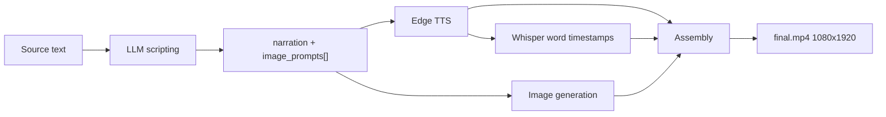

# Faceless

Turns a block of text into a narrated, subtitled **1080×1920 vertical video**.

You paste a story or script. An LLM splits it into narration and visual prompts, Edge TTS voices the narration, Whisper produces word-level timestamps, an image model generates one still per scene, and MoviePy stitches it all into an MP4 with animated word-highlight captions.

Runs entirely on your machine, or leans on APIs — your choice, per stage.

---

## What it does

- **LLM scripting** — Kenari, Ollama (local, free), DeepSeek, or OpenRouter
- **Text-to-speech** — Edge TTS, free, no key, every English voice it exposes
- **Transcription** — faster-whisper with word timestamps, CPU, int8
- **Images** — OpenRouter (Gemini 3.x, Grok Imagine), Kenari (Nano Banana, Grok), or local SDXL / SDXL Turbo
- **Parallel images** — up to 4 concurrent requests on the API providers; local diffusers stays serial
- **Character lock** — a per-project seed so the same cast recurs across scenes
- **Music bed** — optional ambient track, side-chain ducked 18 dB under narration
- **Assembly** — MoviePy + FFmpeg, 1080×1920 @ 24 fps, H.264/AAC
- **Captions** — word-by-word highlighting with a pop-scale animation
- **Cost estimate** before you spend anything, and actual cost tracking after
- **Resume** — every run checkpoints to disk; failed runs restart from the last good stage

---

## Requirements

| | |
|---|---|
| **Python** | 3.13 |
| **OS** | Windows (see [Platform notes](#platform-notes)) |
| **Disk** | ~1.3 GB for dependencies; ~7 GB more per local SDXL model, ~150 MB for Whisper |
| **GPU** | Optional. CPU works, slowly. |

FFmpeg is **not** required on your PATH — MoviePy resolves a bundled binary automatically.

---

## Install

```bash
git clone https://github.com/rlatksk/faceless.git
cd faceless

py -3.13 -m venv .venv
.venv\Scripts\activate
pip install -r requirements.txt
```

Copy the example env file and fill in the keys you need:

```bash
copy .env.example .env
```

```ini
OPENROUTER_API_KEY=sk-or-v1-...
DEEPSEEK_API_KEY=...

# Optional — where model weights are cached
# HF_HOME=
```

| Variable | Needed for | Required? |
|---|---|---|
| `OPENROUTER_API_KEY` | OpenRouter LLM + all OpenRouter image models | Only if you use OpenRouter |
| `DEEPSEEK_API_KEY` | DeepSeek LLM | Only if you pick DeepSeek |
| `KENARI_API_KEY` | Kenari LLM + Kenari image models | Only if you pick Kenari |
| `HF_HOME` | Where Whisper and SDXL weights are cached | Optional but recommended |

### Kenari notes

[Kenari](https://kenari.id) is an OpenAI-compatible gateway billed in Rupiah. Two things worth knowing:

- **A subscription plan covers chat, not images.** Per their billing docs, "embeddings, images, audio, video, rerank, and document reading are always paid from balance." Images need PAYG balance (top up from Rp 1.000); chat works on a plan alone. Without balance, image calls return `402` and the app tells you so.
- **`:free` model IDs cost nothing.** Append `:free` to a chat model id (e.g. `step-3-7-flash:free`) and it runs at Rp 0 with a per-minute rate limit. This is the cheapest way to run the scripting stage with no local model.

The cheapest path needs **no keys at all**: Ollama for scripting, local SDXL Turbo for images, Edge TTS for audio.

Run it:

```bash
streamlit run app.py
```

Opens at `http://localhost:8501`. Launch from the repo root — `.env` and the `output/` directory are both resolved relative to the working directory.

---

## Usage

Three tabs: **Create**, **Projects**, **Settings**.

### Create

Four numbered sections, top to bottom.

**1 · Your story** — paste anything with a narrative: a true-crime story, a Reddit post, a script you wrote. The script model decides how to split it into scenes.

**Import from Reddit** takes a post URL and fills the box for you, so you don't have to copy the text out by hand. Paste any of the usual share shapes:

```
https://www.reddit.com/r/AmItheAsshole/comments/1wkpoj3/title_slug/
https://reddit.com/r/AITAH/comments/abc123/
https://redd.it/1wkpoj3
```

The title becomes the first line of the source, and the post body follows. No API key or Reddit account is needed.

> Reddit serves its JSON API only to logged-in browsers — `www.reddit.com/…/.json` and `api.reddit.com` both return 403 for scripted requests. This reads the Atom feed at `/comments/<id>/.rss` instead, which is served to plain HTTP clients. Link posts have no body and are rejected with a clear message rather than producing a script from a title alone.

**2 · Script** — pick the provider that writes the narration and image prompts. Kenari, DeepSeek and OpenRouter need a key; Ollama runs locally with none. The app warns you only when the provider you selected is missing its key. Model IDs are configurable per provider in **Settings**.

**3 · Look and sound** — voice, style, image model, music, and the character seed.

Voices are pulled live from Edge TTS, filtered to English locales, sorted by name.

| Image model | Provider | Cost |
|---|---|---|
| Nano Banana 2 Lite | Kenari | 150 IDR/img |
| Nano Banana 2 | Kenari | 250 IDR/img |
| Nano Banana Pro | Kenari | 350 IDR/img |
| Grok Imagine | Kenari | 300 IDR/img |
| Gemini 3.1 Flash Lite | OpenRouter | ~$0.035/img |
| Grok Imagine 1K | OpenRouter | ~$0.05/img |
| Gemini 3.1 Flash | OpenRouter | ~$0.07/img |
| Gemini 3 Pro | OpenRouter | ~$0.14/img |
| Local SDXL (10 steps) | Local | Free |
| Local SDXL Turbo | Local | Free |

Add any other OpenRouter model ID in **Settings → Extra image models** (one per line) and it appears in the dropdown.

**Indie Dark Comic** is the built-in style preset — a graphic-novel look with heavy ink outlines, cel shading, and high-contrast lighting. Its template contains a `[INSERT YOUR SCENE / CHARACTER HERE]` placeholder, so each scene prompt gets substituted into it. Pick **Custom** to supply your own tag instead; it is appended to each prompt as `, {your style} style`.

**Lock character (same seed every image)** sends a fixed `seed` with every image request, so the cast stays consistent between scenes instead of drifting. The seed is generated once per session, shown under the toggle, and stored in `project.json` — a resumed run reproduces the same images. Models that reject the field are retried without it rather than failing; the local diffusers path gets it as a torch generator instead.

**Music** picks a track from `assets/music/` (Off by default, so existing behaviour is unchanged) and **Music volume** sets its level. The bed loops to the video length, fades out over the last 2 s, and is ducked 18 dB under speech using the word timestamps — so it sits at full level in pauses and drops out of the way of narration.

The three bundled tracks are synthesised ambient drones generated for this repo, so they are licence-free for monetised uploads. Drop any `.mp3` into `assets/music/` to add your own.

**4 · Cost and render** — one button, whose label tells you what happens next:

| State | Button | Meaning |
|---|---|---|
| Not estimated | **Estimate script** | Runs the script model once. Nothing else is charged. |
| Estimated | **Render video** | Runs the remaining four stages. |
| Script inputs changed | **Re-estimate script** | The stored script no longer matches your text or model. |

The estimate is invalidated only by the things that actually change the script — your source text and the script model. Changing the voice, image model, style, music or seed keeps it, since those are applied at render time.

While rendering, a row of stage chips shows which of the five stages is running:

```
SCRIPT  VOICE  TIMING  IMAGES  RENDER
  done  active     —       —       —
```

Rendering writes everything to `output/<timestamp>/`:

```
output/2026-09-19_143022/
├── project.json       # run state, prompts, steps, cost, seed, music
├── script.txt         # narration + numbered prompts
├── audio.mp3          # Edge TTS output
├── transcript.json    # [{word, start, end}, ...]
├── img_000.png        # one per scene
├── img_001.png
└── final.mp4          # the deliverable
```

### Projects

A gallery of every run, with summary counts and total spend at the top. Each card previews the video (or the first image), shows a status badge and progress bar, and offers **Resume** for anything unfinished or failed. **Details** expands to the audio, per-stage chips, model, music and seed.

Resume restarts from the last incomplete stage — generated images are reused, not regenerated.

### Settings

API key status per provider, the script model default for each, extra OpenRouter image model IDs, and where projects and music live on disk. Keys themselves are read from `.env`; restart the app after editing it.

---

## How it works



Five stages, always in this order, each one a plain function call in `app.py`:

| Stage | Module | Input | Output |
|---|---|---|---|
| Scripting | `pipeline/script.py` | source text | `{narration, image_prompts[]}` |
| Audio | `pipeline/audio.py` | narration, voice | `audio.mp3` |
| Transcription | `pipeline/transcribe.py` | `audio.mp3` | `[{word, start, end}]` |
| Images | `pipeline/images.py` | prompts, model | `img_NNN.png` + cost |
| Assembly | `pipeline/assemble.py` | images, audio, timestamps | `final.mp4` |

**State lives on the filesystem.** There is no database and no in-memory run state — `project.json` plus the artifacts beside it *are* the run. That is what makes resume work: the app infers which stages completed by checking which files exist.

**Image generation is concurrent on the API providers.** `pipeline/images.py` runs up to `MAX_WORKERS` (4) requests at once through a thread pool, which matters because each request is a blocking round trip. `_generate_local` stays serial — one diffusers pipeline is not thread-safe. Images already on disk are skipped without a request, and the first failure still aborts the run, so the existing resume behaviour is unchanged.

**Assembly details.** Scene boundaries are placed by dividing total audio duration across the images, then snapping each boundary to the nearest sentence-ending word so cuts land on natural pauses. Captions are grouped into chunks of up to 5 words or 2 seconds, whichever comes first, and rendered word-by-word: a yellow highlight with a pop-scale animation, followed by the same word in white for the remainder of its duration. Font size shrinks automatically if a line would overflow the frame width.

**Music ducking.** The bed is looped to the narration length, faded out over the last 2 s, and multiplied by a gain envelope sampled at 100 Hz from the word timestamps: `1.0` in pauses, `-18 dB` under speech, with a 50 ms attack and 350 ms release so the transitions are not audible as pumping. Narration is mixed on top unmodified, and the mix is scaled so it cannot clip.

---

## Configuration

`.streamlit/config.toml` sets the dark theme and disables Streamlit telemetry. Most visual styling lives in the `_CSS` block in `app.py` — a Google Fonts import (Teko + Inter), a film-grain overlay, and crimson accents.

Model defaults are editable at runtime under **Settings → Script models**:

- Ollama — `llama3`
- DeepSeek — `deepseek-v4-flash`
- OpenRouter — `openai/gpt-4o-mini`
- Kenari — `deepseek-v4-1-flash`

Local model IDs encode inference steps with a `__N` suffix. `stabilityai/stable-diffusion-xl-base-1.0__10` means SDXL base at 10 steps. Without a suffix, SDXL base runs 30 steps and SDXL Turbo runs 4 at guidance 0.

---

## Project structure

```
faceless/
├── app.py                  # Streamlit UI + pipeline orchestration
├── pipeline/
│   ├── script.py           # Kenari / Ollama / DeepSeek / OpenRouter
│   ├── reddit.py           # Fetch a post's title and body from its Atom feed
│   ├── audio.py            # Edge TTS
│   ├── transcribe.py       # faster-whisper
│   ├── images.py           # OpenRouter / Kenari / local diffusers
│   ├── assemble.py         # MoviePy composite + captions + ducked music
│   └── cost.py             # pricing constants
├── assets/music/           # bundled ambient beds (licence-free)
├── .streamlit/config.toml  # theme + telemetry
├── output/                 # run artifacts (gitignored)
├── requirements.txt
├── AGENTS.md               # notes for AI coding assistants
├── CONTRIBUTING.md
└── .env.example
```

---

## Platform notes

**Windows-first.** The subtitle renderer uses `C:/Windows/Fonts/Arial.ttf` directly. On macOS or Linux that path will not resolve — change `_FONT` in `pipeline/assemble.py` to a font that exists on your system.

**CPU-only by default.** The pinned PyTorch build is CPU-only, so `torch.cuda.is_available()` is always false. Local SDXL is therefore slow — expect minutes per image. SDXL Turbo (4 steps) is dramatically faster and is the recommended free option. CUDA on AMD GPUs is not available.

**First local run downloads weights.** Several GB for SDXL. Set `HF_HOME` to keep them off your system drive. Whisper's `base` model (~150 MB) downloads on first import.

**Streamlit reload behavior.** `app.py` hot-reloads on save. Modules under `pipeline/` do **not** — restart the server after editing them.

---

## Troubleshooting

| Symptom | Cause / fix |
|---|---|
| `Cannot reach Ollama at http://localhost:11434` | Ollama isn't running, or you picked the Ollama provider without starting it. Run `ollama serve`. |
| `OPENROUTER_API_KEY not set in .env` | Key missing or `.env` isn't in the working directory. Launch from the repo root. |
| `Could not load voices` | Edge TTS needs outbound HTTPS. Check connectivity or a proxy. |
| `Only N/M images generated` | One or more image requests failed. Resume — successful images are reused. |
| Projects tab shows no projects | `output/` is empty. Run a generation first. |
| Resume fails on a local-model project | Known limitation — resume refuses local-model projects with a clear message rather than silently using the wrong provider. |
| Video has no captions | Whisper returned no word timestamps, usually on very short or silent audio. |
| Kenari images fail with `insufficient_balance` | Images bill from PAYG balance, which a subscription plan does not cover. Top up at [kenari.id/pay](https://kenari.id/pay). |

---

## Known limitations

- A project generated with a local image model cannot be resumed from the UI; re-run it from the Create tab.
- A project's `failed` status is recalculated on every render, so the failure indicator is often transient.
- The image seed is only as good as the provider: models that ignore `seed` will still drift, and the retry-without-seed fallback means a run can silently proceed unseeded.
- Concurrent image requests are capped at 4 with no rate-limit backoff; a provider that throttles will fail the run rather than wait.
- Long renders still block the browser tab, and refreshing it loses progress — the run is written to disk stage by stage, so Resume recovers it, but the page will not survive the refresh.

See `AGENTS.md` for a fuller list with file and line references.

---

## License

[MIT](LICENSE) © 2026 Justin Salim

Use it, modify it, ship it, sell it. Just keep the copyright notice.
